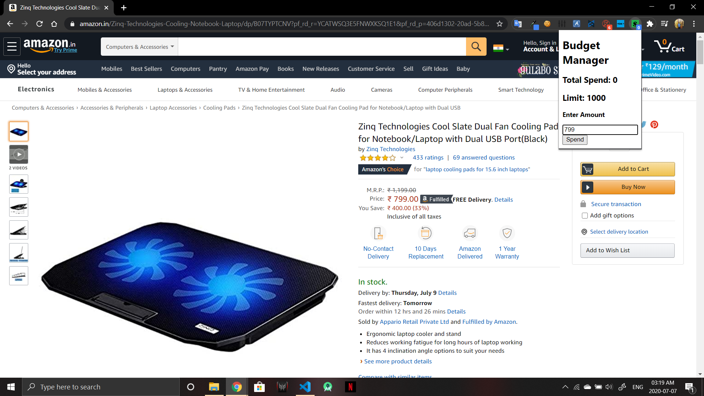
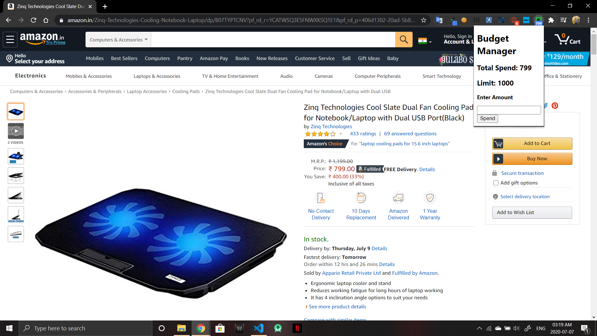
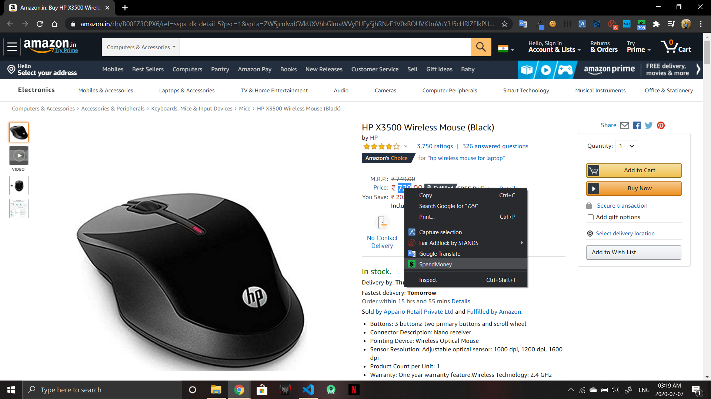
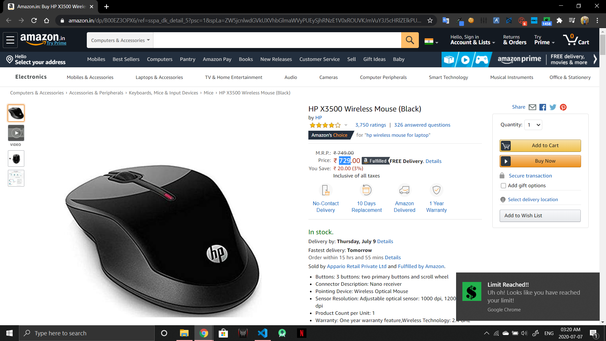
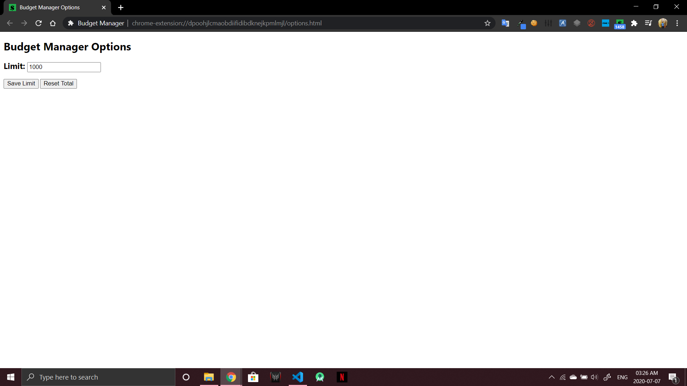

# BudgetManager

### Description
A Chrome extension that tracks your overall spendings.

### Sample Screenshots
1. Add Ammount:

2. Added Ammount:

3. Add Ammount shortcut by right-click menu:

4. Limit Reached Notification:

5. Options Page:

